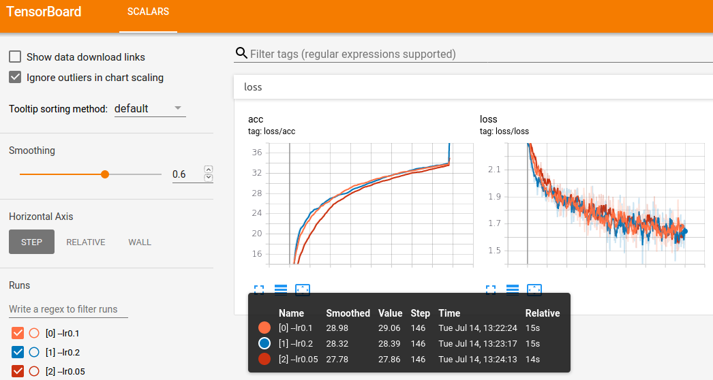

## Invertible Residual Networks

Modification of the <a href="">official Pytorch implementation of i-ResNets</a> (see their README for details).
Uses TensorBoard instead of Visdom, see picture below: 

